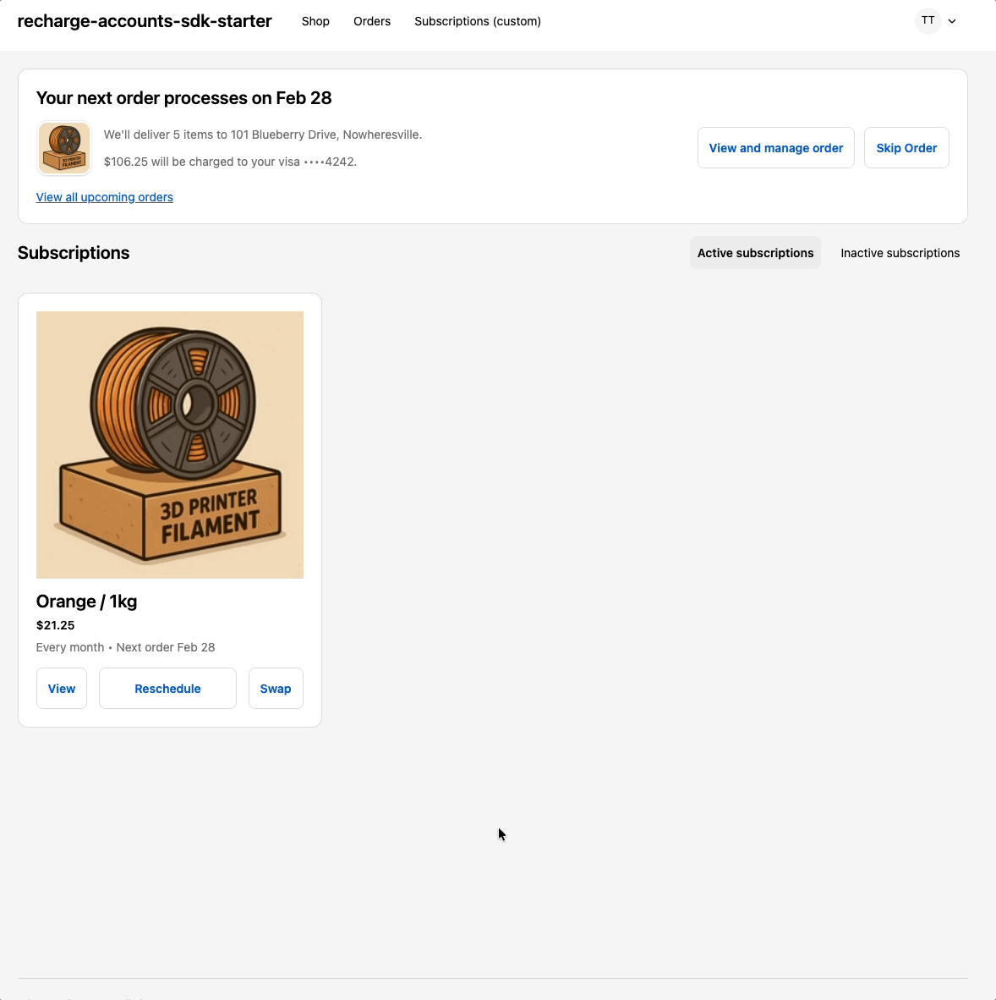
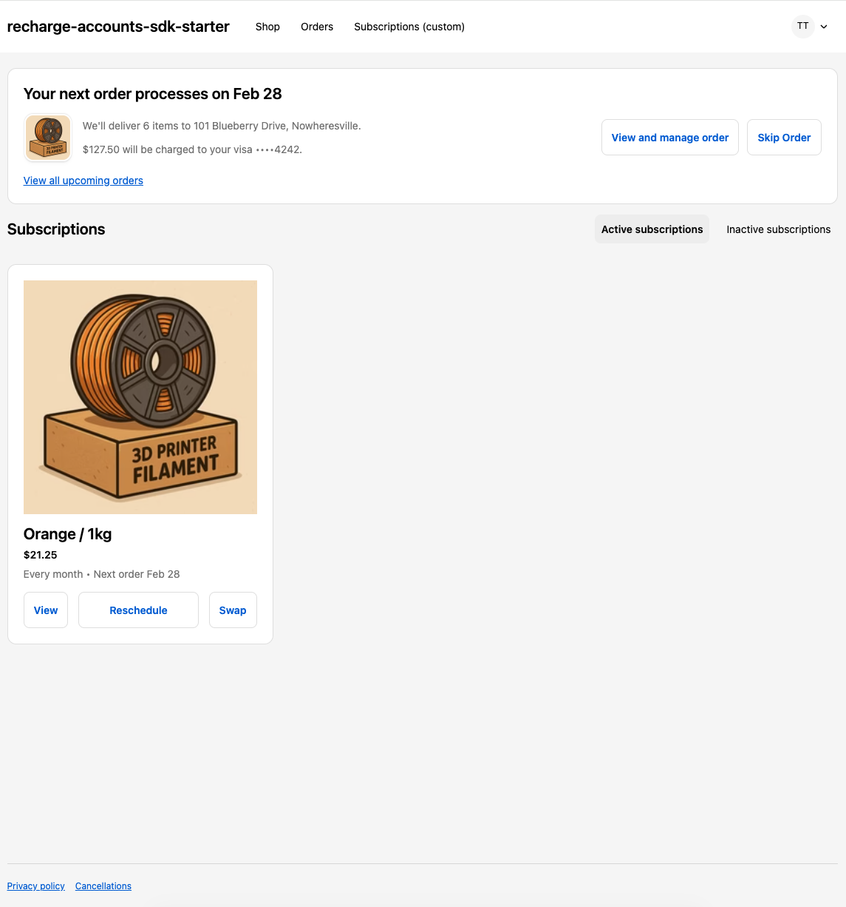

# Building a Shopify Customer Account UI Extension with Recharge SDK Integration

## Overview

This guide walks you through building a **Shopify Customer Account UI Extension** that integrates with Recharge's subscription management platform. The extension allows customers to manage their subscriptions directly within Shopify's Customer Account portal.

### What We're Building

Shopify UI Extensions enable developers to create custom interfaces that extend Shopify's native functionality. In this case, we're building a **Customer Account UI Extension** that targets the **Full Page** render target. This extension will:

- Display customer subscriptions from Recharge  
- Allow customers to manage subscriptions (swap products, reschedule deliveries, skip orders)  
- Show upcoming orders and order history  
- Provide a seamless experience within Shopify's Customer Account portal

**Quick demo**  


**Static screenshot**  


### Architecture Overview

The solution consists of two main components:

1. **Shopify UI Extension**: A Preact-based frontend application that runs within Shopify's Customer Account portal  
2. **Authentication Service**: A backend service that handles session token exchange between Shopify and Recharge

```
┌─────────────────────────────────────┐
│  Shopify Customer Account Portal   │
│  (UI Extension - Frontend)         │
└──────────────┬──────────────────────┘
               │
               │ Session Token
               ▼
┌─────────────────────────────────────┐
│  Backend Auth Service               │
│  (Validates token, creates session) │
└──────────────┬──────────────────────┘
               │
               │ Customer Session
               ▼
┌─────────────────────────────────────┐
│  Recharge Storefront SDK            │
│  (Subscription & order management)  │
└─────────────────────────────────────┘
```

### Why Two Components?

Shopify UI Extensions run in a sandboxed environment and cannot directly authenticate with third-party APIs like Recharge. To use Recharge's Storefront SDK, you need to:

1. Obtain a Shopify session token (provided by Shopify)  
2. Exchange it for a Recharge customer session token (via your backend service)  
3. Use the Recharge session token to make API calls

This guide will walk you through setting up both components.

---

## Prerequisites

Before you begin, ensure you have:

- **Node.js** v20 or higher  
- **pnpm** v9.10.0+  
- [**Shopify CLI** installed](https://shopify.dev/docs/api/shopify-cli)  
- **Shopify Partner Account** with access to [dev.shopify.com](http://dev.shopify.com)  
  - This will provide you with your Shopify App Secret  
- **Recharge Account** with API access  
  - Ensure the Recharge App is installed and configured with products on your test store.  
  - You will need both Admin API Keys and a Storefront Access Token.  
- **Git** (for cloning repositories)

---

## Preview Working Store

The following store has been configured following the steps below.  
**Shopify**: [http://recharge-accounts-sdk-starter.myshopify.com/](http://recharge-accounts-sdk-starter.myshopify.com/)

* Store password: `recharge`

---

## Part 1: Setting Up Your Shopify UI Extension

### Step 1: Create a Shopify App Using Shopify CLI

1. **Initialize the Shopify App**

```bash
$ shopify app init --name your-ui-extension-name
?  Get started building your app:
✔  Build an extension-only app

?  Which organization is this work for?
✔  Your Organization

?  Create this project as a new app on Shopify?
✔  Yes, create it as a new app

?  App name:
✔  your-ui-extension-name
```

2. **Install on your dev store**

```bash
$ shopify app dev
?  Which store would you like to use to view your project?   Type to search...

>  your-ui-extension-name (your-shopify-domain.myshopify.com)

   Press ↑↓ arrows to select, enter to confirm.

11:01:32 │               app-preview │ Preparing dev preview on your-shopify-domain.myshopify.com
11:01:32 │                  graphiql │ GraphiQL server started on port 3457
11:01:32 │                     proxy │ Proxy server started on port 55372
11:01:34 │               app-preview │ ✅ Ready, watching for changes in your app
11:01:34 │                app_access │ │ App has been installed
11:01:34 │                  app_home │ └ Using URL: https://shopify.dev/apps/default-app-home

───────────────────────────────────────────────────────────────────────────────────────────────────────────────────────────────────────────────
│ (d) Dev status │ (a) App info │ (s) Store info │                                                                                     (q) Quit

 ✅ Ready, watching for changes in your app

 › (g) Open GraphiQL (Admin API) in your browser
 › (p) Preview in your browser

 Preview URL: https://your-shopify-domain.myshopify.com/admin/oauth/redirect_from_cli?client_id=some_token
 GraphiQL URL: http://localhost:3457/graphiql
```

This will install the application on your dev store.

### Step 2: Clone and Set Up the Extension Repository

1. **Install the extension and configuration**

After following the shopify app initialization steps:

```bash
git clone <repository-url>/recharge-starter-for-shopify-accounts ~/Downloads
cd your-shopify-app/extensions
mv ~/Downloads/recharge-starter-for-shopify-accounts/extension/ ./customer-portal
cd customer-portal
mv shopify.extension.toml.example shopify.extension.toml
mv src/env.ts.example src/env.ts
```

Update both `shopify.extension.toml` and `src/env.ts` files with your relevant information.

**Note:** In the `src/env.ts` file you will need the `RECHARGE_JWT_API_URL` that you will get from the next section.

2. **Install dependencies**

From the new extension directory, install node_modules:

```bash
$ pnpm install
```

3. **Run the application**

From the root of the Shopify app, run app dev:

```bash
$ shopify app dev
│  Using shopify.app.toml for default values:                                                            
│    • Org:             Your Org                                                                         │
│    • App:             your-app-name                                                                    │
│    • Dev store:       your-shopify-domain.myshopify.com                                                │
│    • Update URLs:     Yes                                                                              
│   You can pass `--reset` to your command to reset your app configuration.                              

12:39:35 │               app-preview │ Preparing dev preview on your-shopify-domain.myshopify.com
12:39:35 │                  graphiql │ GraphiQL server started on port 3457
12:39:35 │                     proxy │ Proxy server started on port 57919
12:39:36 │           customer-portal │ Build successful
12:39:37 │               app-preview │ ✅ Ready, watching for changes in your app
12:39:37 │                app_access │ │ App has been installed
12:39:37 │                  app_home │ └ Using URL: https://shopify.dev/apps/default-app-home

───────────────────────────────────────────────────────────────────────────────────────────────────────────────────────────────────────────────
│ (d) Dev status │ (a) App info │ (s) Store info │                                                                                     (q) Quit

 ✅ Ready, watching for changes in your app

 › (g) Open GraphiQL (Admin API) in your browser
 › (p) Preview in your browser

 Preview URL: https://isbn-final-degree-badge.trycloudflare.com/extensions/dev-console
 GraphiQL URL: http://localhost:3457/graphiql
```

When you preview, you should now see a subscriptions loading skeleton with an error.  


### Step 3: Ensure App Permissions

You can access the following settings by going to your Shopify Dev dashboard → Settings

**Network access**  
Ensure your application has Network access enabled. Without it, you will not be able to fetch correctly.

**Storefront API**  
You will need access to the Storefront API. To do this, you need to choose your distribution setting. For this guide, you can choose custom and then provide the [myshopify.com](http://myshopify.com) domain for the url.

---

## Part 2: Setting Up the Authentication Service

The authentication service is provided in the `server/` folder. It is a backend service that exchanges Shopify session tokens for Recharge customer session tokens. This service needs to be hosted separately and accessible via HTTPS.

### Step 1: Clone and Set Up the Service

1. **Navigate to the server directory**

```bash
cd server
```

2. **Install dependencies**

```bash
pnpm install
```

### Step 2: Configure Environment Variables

1. **Create environment file**

```bash
cp .env.example .env
```

2. **Edit `.env` and add your credentials**  
     
   **Required Variables:**  
   - `SHOPIFY_APP_SECRET`: Your Shopify app's shared secret  
     - Found in: Shopify Partner Dashboard → Your App → **Settings** → **Credentials** → **Secret**  
   - `RECHARGE_ADMIN_TOKEN`: Your Recharge admin API token  
     - Required scopes: `write_sessions`, `read_customer`  
     - Found in: Recharge Merchant Portal → **Tools & Apps** → **API Tokens** → Admin tokens → Create new  
   - `RECHARGE_STOREFRONT_TOKEN`: Your Recharge storefront access token  
     - Select your required scopes based on what your extension needs  
     - Found in: Recharge Merchant Portal → **Tools & Apps** → **API Tokens** → Storefront tokens → Create new   
   - `PORT`: Server port (default: 3000)  
     - Optional, defaults to 3000 if not set

   **Example `.env` file:**

```env
SHOPIFY_APP_SECRET=your_shopify_app_secret_here
RECHARGE_ADMIN_TOKEN=your_recharge_admin_token_here
RECHARGE_STOREFRONT_TOKEN=your_recharge_storefront_token_here
```

### Step 3: Test Locally

1. **Start the server**

```bash
pnpm dev
ngrok http 3000
```

   The server will start on [`http://localhost:3000`](http://localhost:3000) when using Ngrok it will give you a publicly accessible application endpoint.

   You can make requests to your local via any HTTP client, or if you use Ngrok can hit your local server directly.

### Step 4: Deploy the Service

Deploy the service to your desired cloud service. For testing, you can use ngrok to get an accessible URL.

---

## Part 3: Testing the Complete Integration

### Step 1: Ensure Both Services Are Running

1. **Backend Service**: Should be deployed and accessible via HTTPS  
2. **Shopify Extension**: Should be running via `shopify app dev` or deployed

### Step 2: Test the Flow

1. In a browser, go to your shopify store, and login using the customer email and one time password.  
   - The following steps should be done in the same browser so the extension has access to the customer session.  
2. View the preview from the CLI by pressing `p` on the CLI interface. This will bring up the shopify dev dashboard for your extension.  
3. Click on the customer portal extension.  
4. You should see the customer portal load.

---

## Project Structure

```
extension/
├── src/
│   ├── components/          # Reusable UI components
│   ├── hooks/               # Custom React hooks for data fetching
│   ├── pages/               # Page components (routes)
│   ├── router/              # Client-side routing implementation
│   ├── utils/               # Utility functions and API wrappers
│   ├── routes.ts            # Route configuration
│   └── FullPage.tsx         # Extension entry point
├── locales/                 # Translation files
└── shopify.extension.toml   # Extension configuration

server/
├── routes/                  # API route handlers
├── index.ts                 # Server entry point
└── .env                     # Environment variables
```

## Key Concepts

### Routing

The starter includes a custom router that supports:
- Dynamic route parameters (`/subscriptions/:id`)
- Route metadata (titles, etc.)
- Programmatic navigation via hooks
- Direct linking support

### Data Fetching

Custom hooks provide:
- Automatic caching with Shopify Storage API
- Background data synchronization
- Request deduplication
- Optimistic updates

### Recharge Integration

This starter integrates with Recharge's Storefront SDK for:
- Listing and managing subscriptions
- Handling charges and orders
- Updating subscription details
- Date calculations and scheduling

## Customization

### Adding New Routes

Edit `src/routes.ts` to add new routes:

```typescript
{
    path: '/my-route',
    component: MyComponent,
    meta: { title: 'My Page' },
}
```

### Creating New Hooks

Follow the pattern in `src/hooks/` for creating new data fetching hooks with caching support.

### Styling

Use Shopify Polaris Web Components (`<s-button>`, `<s-page>`, etc.) for consistent UI. Custom styling can be added via the component props.

## Tech Stack

- **Framework**: Preact (React-compatible)
- **Language**: TypeScript
- **UI Components**: Shopify Polaris Web Components
- **API**: Recharge Storefront SDK (`@rechargeapps/storefront-client`)
- **Routing**: Custom router implementation
- **Package Manager**: pnpm

## Features

- **Subscription Management**
  - View active and inactive subscriptions
  - Swap products, reschedule delivery dates, skip items
  - Cancel subscriptions with reason tracking
  - Reactivate cancelled subscriptions

- **Order Management**
  - View upcoming orders and order history
  - Reschedule or skip entire orders
  - Order detail pages with full charge information

- **Client-Side Routing**
  - Custom router implementation with URL matching
  - Direct linking support for deep navigation
  - Programmatic navigation hooks

- **Data Management**
  - Persistent caching with Shopify Storage API
  - Background data synchronization
  - Optimistic updates with error handling

- **Product Integration**
  - Product image fetching via Shopify Product Search API
  - Variant information display
  - Bundle product support
